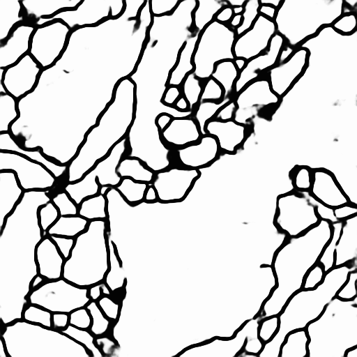

# Dilated-U-net - Stacked Electron Microscopy (EM) segmentation.

| Model            | Training Loss | Validation Loss | Training Dice | Validation Dice |
|------------------|---------------|-----------------|---------------|-----------------|
| U-net            | 0.056         | 0.106           | 0.985         | 0.979           |
| Dilated U-net    | 0.057         | 0.111           | 0.985         | 0.978           |
| U-net A*         | 0.073         | 0.0864          | 0.981         | 0.980           |
| Dilated U-net A* | 0.0579        | 0.114           | 0.985         | 0.978           |

A* represents the central part of the U-net having no concatenate *add* operation. (--addition 0)

**Training images and masks**

**Test time images and predictions**

Dilated/Atrous convolutions have the ability to increase the receptive field of a network expontentially. Therefore, whilst segmentation requires fine-grain classification accuracy (pixel-wise level), the ability of a network to learn features based on a wide receptive field capturing alot of the input space could be beneficial.

Here I implement a standard U-net against a U-net architecture whose bottleneck/center layers are replaced with expontentially growing dilated convolutions.

**Standard U-net**:

`python dilatedUnet.py --lr 0.00001 --max_lr 0.01 --epochs 500 --dilate_rate 1 --dilate 0 --weight_path weights/standard_unet.weights --addition 1`

**Dilated U-net**:

`python dilatedUnet.py --lr 0.00001 --max_lr 0.01 --epochs 500 --dilate_rate 2 --dilate 1 --weight_path weights/dilated_unet.weights --addition 1 `

The dataset used is the ISBI-2012 stack of electron-microscopy images (n=30) - Representing a challenge to learn from so little data. It seems to be the case that dilated convolutions may only help on datasets that may benefit from learning global relationships. For this EM data - it makes no difference.

Cyclical learning rates, much like sudden learning rate drops as compared to exponential lr decay have been shown to improve both final validation accuracy and also decrease training time to convergence ([LN Smith, 2015](https://arxiv.org/abs/1506.01186)). Here I use a triangular lr schedule as implemented by [bckenstler](https://github.com/bckenstler/CLR).

