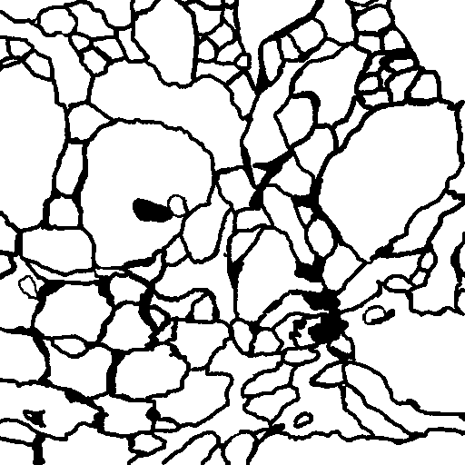

# Dilated-U-net

Dilated/Atrous convolutions have the ability to increase the receptive field of a network expontentially. Therefore, whilst segmentation requires fine-grain classification accuracy (pixel-wise level), the ability of a network to learn features based on a wide receptive field capturing alot of the input space could be beneficial.

Here I test a standard U-net implementation against a U-net architecture whose bottleneck/center layers are replaced with expontentially growing dilated convoltions.

The dataset used is the ISBI-2012 stack of electron-microscopy images (n=30) - Representing a challenge to learn from so little data.

